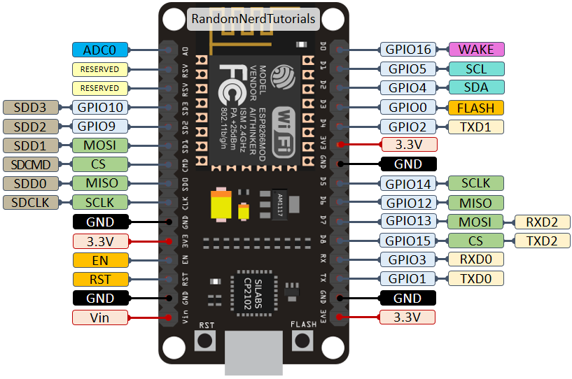

# Arduino interfaz twingo timon control kenwood bt-328


### References:
- https://www.kenwood.com/pa/car/head_units/kmm-bt328/
- https://articulo.mercadolibre.com.co/MCO-555947676-control-de-audio-ve-interfaz-para-twingo-clio-y-symbol-_JM#backend=item_decorator&backend_type=function&client=bookmarks-polycard
- https://github.com/bigevtaylor/arduino-swc
- https://www.instructables.com/Custom-Arduino-to-Keep-CAN-Steering-Wheel-Buttons-/
- https://www.youtube.com/watch?v=epe_4fnpTjk&ab_channel=JustinNelson%27sProjects
- https://github.com/tsprlng/toyota-kenwood-adaptor ## works
- http://drclone.blogspot.com/2015/01/controlar-autorradio-sony-con-los.html
- https://www.youtube.com/watch?v=6VO589mRQkM&ab_channel=TravisColesen


### 

- https://www.youtube.com/watch?v=vRJ6ywV8bLI&ab_channel=Electr%C3%B3nicaAWV
- https://randomnerdtutorials.com/esp8266-pinout-reference-gpios/




```

D4 -> 2
D8 -> 15
D2 -> 4
D6 -> 12
D5 -> 14
D1 -> 5 -> Stereo Output -> kenwood


```
