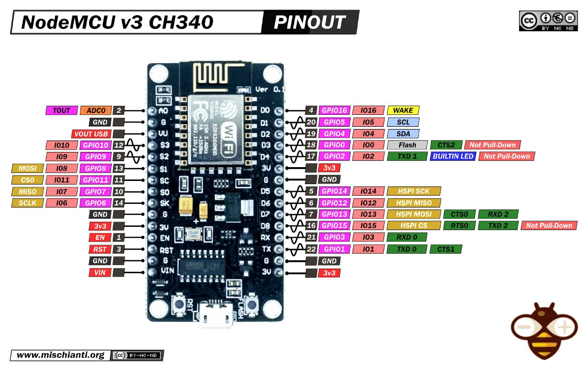

# Arduino Interfaz Twingo Timon Control Kenwood BT-328


### References:
- https://www.kenwood.com/pa/car/head_units/kmm-bt328/
- https://articulo.mercadolibre.com.co/MCO-555947676-control-de-audio-ve-interfaz-para-twingo-clio-y-symbol-_JM#backend=item_decorator&backend_type=function&client=bookmarks-polycard
- https://github.com/bigevtaylor/arduino-swc
- https://www.instructables.com/Custom-Arduino-to-Keep-CAN-Steering-Wheel-Buttons-/
- https://www.youtube.com/watch?v=epe_4fnpTjk&ab_channel=JustinNelson%27sProjects
- https://github.com/tsprlng/toyota-kenwood-adaptor ## works
- http://drclone.blogspot.com/2015/01/controlar-autorradio-sony-con-los.html
- https://www.youtube.com/watch?v=6VO589mRQkM&ab_channel=TravisColesen
- https://www.youtube.com/watch?v=RdR43ACfeu8&t=257s&ab_channel=MentalidadDeIngenier%C3%ADa
- https://www.youtube.com/watch?v=d-j0onzzuNQ&t=305s&ab_channel=TheEngineeringMindset
- https://lastminuteengineers.com/esp8266-pinout-reference/
- https://randomnerdtutorials.com/esp8266-pinout-reference-gpios/
- https://www.kenwood.com/asia/car/Steering-remote/
- https://www.youtube.com/watch?v=fk73SCOE8qU&ab_channel=BartKuijper
- https://pastebin.com/fXbScxV4 // code with jvc and twingo


### Pinout
- https://lastminuteengineers.com/esp8266-pinout-reference/
- https://lededitpro.com/esp8266-pinout-guide-gpios/

### 

- https://www.youtube.com/watch?v=vRJ6ywV8bLI&ab_channel=Electr%C3%B3nicaAWV
- https://randomnerdtutorials.com/esp8266-pinout-reference-gpios/


### Commands
```
$ make upload
$ make compile
$ make just-compile
```


| Pin		|     Arnes Color 	|   ESP8266 Pin	| Card	Control Color	|
|---------------|-----------------------|---------------|-----------------------|
| 4		| 	Green		| 	D2 	|	Green 		|
| 2	 	| 	White 		|	D4 	|	Brown 		|
| 15 	 	| 	Yellow		|	D8 	|	Yellow 		|
| 12 	 	| 	Blue		|	D6 	|	Light Blue 	|
| 13 		| 	White/Brown 	|	D7 	|	Black		|		
| 14 	 	| 	White/Orange 	|	D5 	|	Red 		|


```

D4 -> 2
D8 -> 15
D2 -> 4
D6 -> 12
D5 -> 14
D1 -> 5 -> Stereo Output -> kenwood


```


```
Red Wire -> Ignition stereo car
Black Wire -> Negative Stereo Wire harness
Yellow Wire -> light/blue Wire Stero Harness

```


### Command
<!---->


### Twingo Access


## New features
- beep: to know if the device started, from driver's seat



## Green Output (OK) only works for leds or something like


